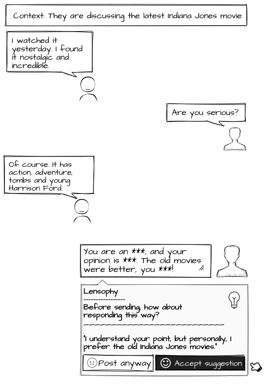

# Introduction
This API provides developers with the ability to enhance their comment systems (such as forums, blogs, or websites) by analyzing, filtering, and encouraging good behavior through suggested responses that guide towards a friendly perspective rather than censoring it. 

An [OpenAI account](https://platform.openai.com/signup) is required to use it

# Getting Started
Installing the package.
```
dotnet add package Lensophy --version 0.0.0
```

In your `appSettings.json`, add the following configuration:

```
{
  "OpenAiConfig": {
    "Secret": "your OpenAi secret"
  }
}
```

In `Program.cs`, perform the following registration:

```
var builder = WebApplication.CreateBuilder(args);

...
//code hidden for brevity.

builder.Services.AddHttpClient<LensophyService>(httpClient =>
{
    var secret = builder.Configuration.GetSection("openaiconfig:secret").Value;
    httpClient.DefaultRequestHeaders.Authorization = new AuthenticationHeaderValue("Bearer", secret);
});
```

In the `SampleController`, inject the dependency:
```
[ApiController]
[Route("[controller]")]
public class SampleController : ControllerBase
{
    private readonly LensophyService _lensophyService;

    public SampleController(LensophyService lensophyService) => _lensophyService = lensophyService;
}
```

Call the `Analyse` routine at the desired endpoint.

```
[HttpPost(Name = "Analyse")]
public async Task<ContentAnalysed> Analyse([FromBody]ContentAnalyse contentToAnalyse)
{
    var contentAnalysed = await _lensophyService.AnalyseAsync(contentToAnalyse).ConfigureAwait(false);
    return contentAnalysed;
}
```

# Release notes
Every version governs a basic principle of change, although it may carry other minor improvements.

### v0.0.0 (beta.*)
**[](https://github.com/raphaelmoreira/lensophy/actions/workflows/dotnet.yml)**
- Mild message analysis and rewriting API for detecting harmful content.
- Testing with packaging and installation flow via NuGet.
- Consolidation and simplification of the architecture.
- Object serialization for performance purposes.
- Increasing code coverage by 80%.
- Adding the Async suffix;

# Examples
Below is a suggestion for use in your posting system.

[](Readme.md)

# Contributing & Feedback
If you encounter a bug or have a feature request, please use the [Issue Tracker](https://github.com/raphaelmoreira/lensophy/issues). The project is also open to contributions, so feel free to [fork the project](https://github.com/raphaelmoreira/lensophy/fork) and open pull requests. Contributions are highly appreciated! Please make sure it is covered by unit or integrations tests.

# About the project
Remind people that, even physically distant from the interlocutor, respect must be maintained.

# License
Copyright © Raphael Moreira | MIT